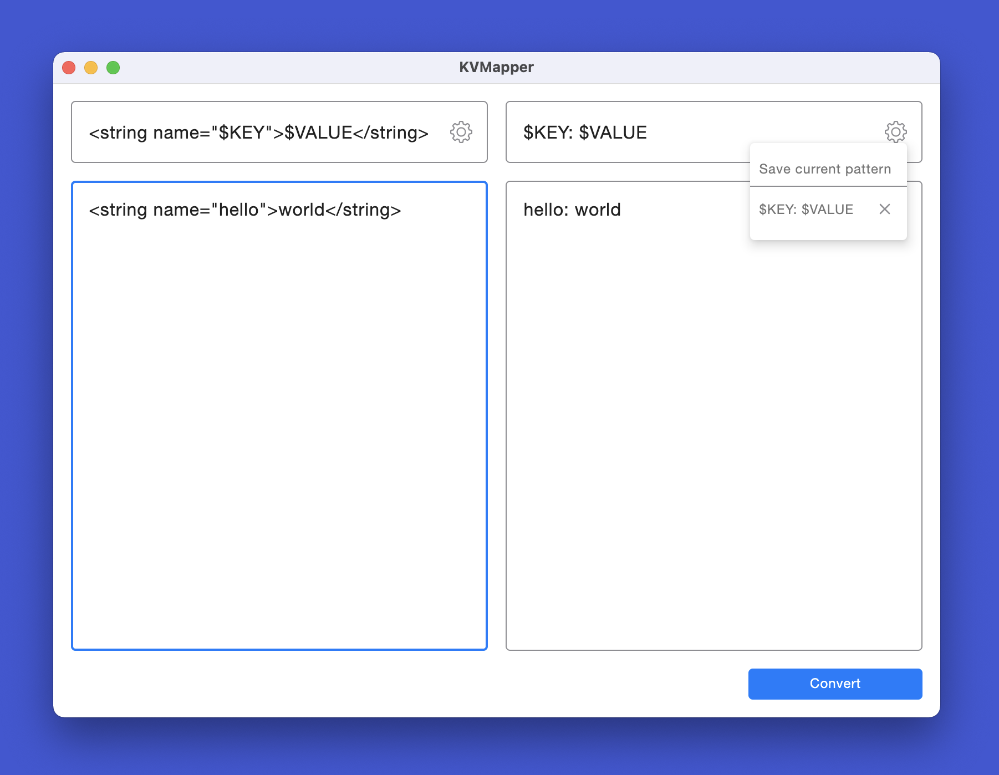

#  KVMapper 

   
<br /><br />
KVMapper is an application to convert key-value pairs from one format to another.
<br /><br />



## About

This app was purely written in Kotlin and compiled for macOS. The UI was created with `Compose Desktop` and styled to be similar to the system design of macOS 12.

A list of key-value pairs can be pasted into the input field and then converted to a different format by specifying an input and output pattern. The pattern can also be saved to reuse them.

## Tech

- Coroutines + StateFlow (MVI pattern with statemachine)
- Turbine (Unit tests)
- Compose Desktop (UI)
- Kotlin File API (Persistence)

## Download

##### Version 1.1

- macOS 10.10+ (Silicon): [KVMapper.app](https://github.com/snappdevelopment/KVMapper/releases/download/1.1/KVMapper.Silicon.app.zip)
- macOS 10.10+ (Intel): [KVMapper.app](https://github.com/snappdevelopment/KVMapper/releases/download/1.1/KVMapper.app.zip)
- Source: [Release 1.1](https://github.com/snappdevelopment/KVMapper/archive/refs/tags/1.1.zip)

> Since this is a hobby project, the macOS app is not signed with a developer ID from Apple. When opening the app, there might pop up a window saying the app is damaged and can't be opened. If you encounter this issue, then you can try to take the app out of quarantine mode or manually grant executable rights with the following terminal commands. Then try again:

Disable quarantine mode for this app:
```
sudo xattr -d com.apple.quarantine /path/to/app/KVMapper.app
```
Grant executable rights, if the first command didn't work:
```
sudo chmod +x /path/to/app/KVMapper.app/Contents/MacOS/KVMapper
```
Alternatively you can clone this project and build the app yourself. See section [Building](#Building).

## Usage

- Type the pattern for your input in the input pattern field by using `$KEY` and `$VALUE` to mark the position of key and value (e.g. `<$KEY><$VALUE>`)
- Do the same for your desired output in the output pattern field
- Paste your input into the input field. One key-value pair per line
- Click the `Convert` button to see your converted key-value pairs in the output field
- Click on the `Settings` icon in the pattern fields and choose `Save current pattern` to save your pattern for the next time you need it

#### Input:
```
Input pattern: 
<string name="$KEY">$VALUE</string>

Input:
<string name="app_title">KVMapper</string>
<string name="button_convert">Convert</string>
```
#### Output:
```
Output pattern:
$KEY: $VALUE

Output:
app_title: KvMapper
button_convert: Convert
```

## Building

- Run the app: `./gradlew run` or `./gradlew runRelease`
- Build a distributable: `./gradlew createDistributable` or `./gradlew createReleaseDistributable`

> Distributable is built to: `build/compose/binaries/main/app`  
> Building requires JDK 16: `Preferences -> Gradle -> Gradle JDK`

## License

```
KVMapper
Copyright © 2022 SNAD

This program is free software: you can redistribute it and/or modify
it under the terms of the GNU General Public License as published by
the Free Software Foundation, either version 3 of the License, or
(at your option) any later version.

This program is distributed in the hope that it will be useful,
but WITHOUT ANY WARRANTY; without even the implied warranty of
MERCHANTABILITY or FITNESS FOR A PARTICULAR PURPOSE.  See the
GNU General Public License for more details.

You should have received a copy of the GNU General Public License
along with this program.  If not, see <https://www.gnu.org/licenses/>.
```
See [LICENSE](LICENSE.md) to read the full text.
